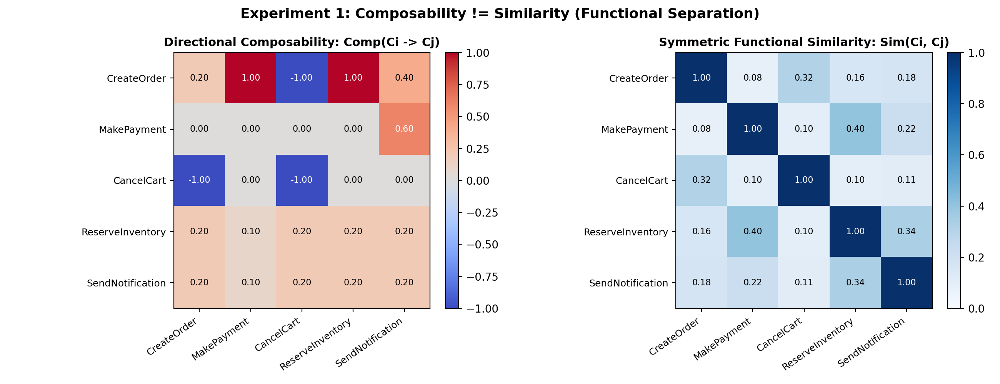
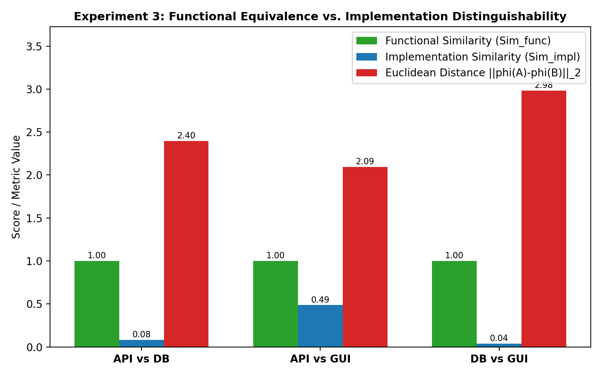
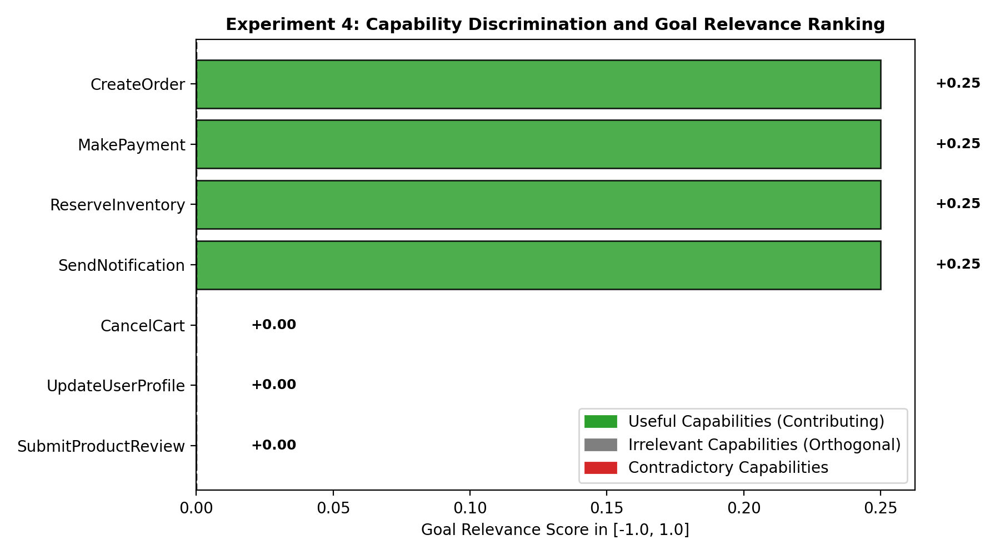
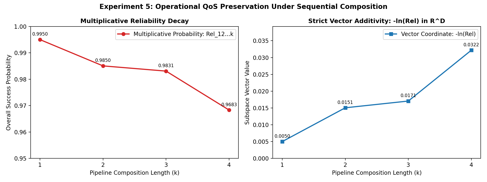

# Vector Embedding for Capability Composition
## Formal Representations, Compatibility, and Compositional Reasoning
### PCCST503 – Assignment 2
**Submitted by:** KARRI KHOHITH — TCR24CS041

> **Assignment 2**: Design, implementation, and evaluation of a problem-specific vector representation for formally specified states, goals, and executable capabilities that preserves the functional relationships required to identify compatible capabilities and construct complex capabilities from simpler ones.

---

## Table of Contents
1. [Project Overview & Motivation](#1-project-overview--motivation)
2. [Fundamental Challenges in Embedding Capabilities](#2-fundamental-challenges-in-embedding-capabilities)
3. [Formal Application & Capability Model](#3-formal-application--capability-model)
4. [Structured Subspace Vector Representation](#4-structured-subspace-vector-representation)
5. [Mathematical Formulation & Metrics](#5-mathematical-formulation--metrics)
6. [Capability Composition Operator](#6-capability-composition-operator)
7. [Deliverables Summary](#7-deliverables-summary)
   - [Deliverable 1: Formal Embedding Design](#deliverable-1-formal-embedding-design)
   - [Deliverable 2: Working Implementation (capembed)](#deliverable-2-working-implementation-capembed)
   - [Deliverable 3: Experimental Datasets](#deliverable-3-experimental-datasets)
   - [Deliverable 4: Technical Report](#deliverable-4-technical-report)
8. [The 5 Required Experiments & Results](#8-the-5-required-experiments--results)
9. [Evaluation Against All Criteria](#9-evaluation-against-all-criteria)
10. [Repository Structure](#10-repository-structure)
11. [Quickstart & Reproduction Guide](#11-quickstart--reproduction-guide)

---

## 1. Project Overview & Motivation

In automated task execution, service orchestration, and modern AI agent planning, software operations are formal **capabilities**. A capability is a reusable, well-defined service characterized by:
- What it requires (**inputs**, **preconditions**, **resources**),
- What it does (**effects**),
- What it produces (**outputs**), and
- The constraints and Quality of Service (**QoS**) attributes under which it operates (**cost**, **latency**, **reliability**, **availability**).

While Assignment 1 focused on planning algorithms (e.g., A*, LPA*, D* Lite) to search for sequences of transitions, **Assignment 2 shifts the focus from finding the sequence to representing the operations themselves in continuous vector space**.

The central objective is to design, implement, and evaluate a vector space representation $\phi(C) \in \mathbb{R}^D$ such that:
1. Functionally compatible capabilities can be identified algebraically.
2. Complex capabilities can be constructed directly from simpler ones via closed vector composition operators.
3. Relevant capabilities can be distinguished from irrelevant ones with respect to a target goal specification.

---

## 2. Fundamental Challenges in Embedding Capabilities

While continuous representations map symbolic tokens into geometry, applying standard unstructured or semantic embeddings directly to executable operations fails fundamentally:

```
Standard Semantic Embeddings                    This System: Functional Composability
       Service A ◄──► Service B                        CreateOrder
   (Substitutes / Competitors)                              │ (OrderExists = True)
     Symmetric Cosine Closeness                             ▼
     Falsely Suggests Composition                      MakePayment
                                              (Directional Contract Satisfaction)
```

1. **Similarity $\neq$ Composability**:
   - Two substitutable capabilities (e.g., `PayWithStripe` and `PayWithPayPal`) are functionally almost identical ($\text{Sim}_{\text{func}} \approx 1.0$). Yet they **cannot compose** sequentially (running Stripe does not satisfy PayPal).
   - In contrast, `CreateOrder` and `MakePayment` share no semantic resemblance ($\text{Sim}_{\text{func}} \approx 0.08$), but they **compose perfectly** ($\text{Comp} = 1.0$) because the effect of `CreateOrder` satisfies the precondition and input of `MakePayment`.
2. **Directional Asymmetry**:
   - Standard cosine similarity is symmetric: $\cos(\mathbf{u}, \mathbf{v}) \equiv \cos(\mathbf{v}, \mathbf{u})$.
   - Capability execution is strictly directional: `CreateOrder` $\to$ `MakePayment` is valid, but `MakePayment` $\to$ `CreateOrder` is invalid.
3. **Precondition Internalization & Absorption**:
   - When capabilities compose, intermediate requirements are satisfied internally and should not leak into the composite interface. Traditional vector addition lacks mechanisms for condition absorption.
4. **Multiplicative Reliability vs. Linear Vector Space**:
   - Independent component reliabilities multiply ($Rel_{12} = Rel_1 \times Rel_2$). Standard vector addition cannot represent multiplicative decay without specialized coordinate mapping.

---

## 3. Formal Application & Capability Model

An application is formally defined as a 6-tuple:
$$\mathcal{A} = (\mathcal{S}, \mathcal{C}, S_I, \mathcal{G}, \mathcal{R}, \mathcal{K})$$
- $\mathcal{S}$: State space, where $S = \{(x_1, v_1), \dots, (x_n, v_n)\}$ maps variables to values.
- $\mathcal{C}$: Set of available capabilities.
- $S_I \in \mathcal{S}$: Initial state before execution.
- $\mathcal{G} = \{g_1, \dots, g_m\}$: Goal specification; $S \models \mathcal{G}$ when target conditions are met.
- $\mathcal{R}$: Set of shared resources (Database, PaymentGateway, Network, GPU, Cluster, etc.).
- $\mathcal{K}$: Global constraints and policies (transaction limits, role boundaries).

Each capability $C_i \in \mathcal{C}$ is formalized as an 11-tuple:
$$C_i = (T_i, I_i, O_i, P_i, E_i, K_i, R_i, Q_i, Rel_i, A_i, M_i)$$
- **Type ($T_i$)**: Broad mechanism $\in \{\text{API}, \text{DATABASE}, \text{GUI}, \text{EVENT}, \text{FUNCTION}, \text{FILE}, \text{COMPUTATION}, \text{MESSAGE}, \text{SERVICE}\}$.
- **Inputs ($I_i$) & Outputs ($O_i$)**: $i_j = (\text{name}, \text{type}, \text{domain}, \text{required})$, $o_j = (\text{name}, \text{type}, \text{domain})$.
- **Preconditions ($P_i$) & Effects ($E_i$)**: $C_i$ applicable to $S \iff S \models P_i$; $S' = \text{Apply}(S, E_i)$.
- **Constraints ($K_i$)**: Capability-specific guards.
- **Resources ($R_i$)**: Hardware/software dependencies.
- **Quality Attributes ($Q_i$)**: Operational costs $(C_{\text{time}}, C_{\text{resource}}, C_{\text{money}}, C_{\text{risk}}, C_{\text{energy}})$.
- **Reliability ($Rel_i \in [0, 1]$)**: Success probability.
- **Availability ($A_i \in \{0, 1\}$)**: Readiness flag.
- **Execution Mechanism ($M_i$)**: Implementation signature (endpoints, tables, component IDs).

---

## 4. Structured Subspace Vector Representation

To preserve these relationships, `capembed` employs a **Structured Dual-Subspace Partitioned Tensor Embedding**:

$$
\phi_C(C) = \left[ \mathbf{v}_{\text{pre}}, \, \mathbf{m}_{\text{pre}}, \, \mathbf{v}_{\text{eff}}, \, \mathbf{m}_{\text{eff}}, \, \mathbf{v}_{\text{in}}, \, \mathbf{v}_{\text{out}}, \, \mathbf{v}_{\text{type}}, \, \mathbf{v}_{\text{mech}}, \, \mathbf{v}_{\text{res}}, \, \mathbf{v}_{\text{ops}} \right]^T \in \mathbb{R}^D
$$

### Subspace Breakdown
| Subspace | Dimension | Representation | Purpose |
| :--- | :---: | :---: | :--- |
| `v_pre`, `m_pre` | `2 * d_state` | Real & Binary vectors | Target precondition values & indicator presence mask |
| `v_eff`, `m_eff` | `2 * d_state` | Real & Binary vectors | Resulting state changes & modified variable mask |
| `v_in`, `v_out` | `2 * d_io` | Real vectors | Input requirements & produced output schema vectors |
| `v_type` | `d_type` | One-hot binary vector | Capability execution type (API, DATABASE, GUI, etc.) |
| `v_mech` | `d_mech` | Real feature vector | Signature of execution mechanism M_i |
| `v_res` | `d_res` | Multi-hot binary bitmask | Required resource locks (Database, Network, etc.) |
| `v_ops` | `7` | Scaled QoS vector | Operational profile: [time, cost, res, risk, energy, -ln(Rel), avail] |

Total dimension for the E-Commerce domain is $D = 117$.

---

## 5. Mathematical Formulation & Metrics

### 5.1 Directional Precondition–Effect Compatibility (Gamma_PE)
For transition $C_i \to C_j$, does $C_i$'s effect satisfy $C_j$'s precondition?
Let $\mathbf{m}_{ij}^{\text{overlap}} = \mathbf{m}_{\text{eff}, i} \odot \mathbf{m}_{\text{pre}, j}$:

$$
\Gamma_{PE}(C_i, C_j) = \frac{\sum_{k=1}^{d_{\text{state}}} m_{ij}^{\text{overlap}}[k] \cdot \text{sgn}\left(v_{\text{eff}, i}[k] \cdot v_{\text{pre}, j}[k]\right)}{\sum_{k=1}^{d_{\text{state}}} m_{ij}^{\text{overlap}}[k] + \epsilon}
$$

- `Gamma_PE = +1.0`: Complete agreement (precondition satisfied).
- `Gamma_PE = -1.0`: Contradiction conflict (e.g., $E_i$ produces `OrderExists=True`, but $P_j$ requires `OrderExists=False`).

### 5.2 Input–Output Dataflow Compatibility (Gamma_IO)

$$
\Gamma_{IO}(C_i, C_j) = \frac{\sum_{k=1}^{d_{\text{io}}} \min\left(v_{\text{out}, i}[k], \, v_{\text{in}, j}[k]\right)}{\sum_{k=1}^{d_{\text{io}}} v_{\text{in}, j}[k] + \epsilon}
$$

### 5.3 Directional Composability Score (Comp)

$$
\text{Comp}(C_i, C_j) = \begin{cases}
\Gamma_{PE}(C_i, C_j) & \text{if } \Gamma_{PE}(C_i, C_j) < 0 \\
0.6 \cdot \Gamma_{PE}(C_i, C_j) + 0.4 \cdot \Gamma_{IO}(C_i, C_j) & \text{if } \Gamma_{PE}(C_i, C_j) \ge 0
\end{cases}
$$

Strictly asymmetric: $\text{Comp}(C_i, C_j) \neq \text{Comp}(C_j, C_i)$.

### 5.4 Functional vs. Implementation Similarity
- **Functional Similarity**:
  $$\text{Sim}_{\text{func}}(C_i, C_j) = \cos(\mathbf{v}_{\text{func}, i}, \mathbf{v}_{\text{func}, j})$$
- **Implementation Similarity**:
  $$\text{Sim}_{\text{impl}}(C_i, C_j) = \cos([\mathbf{v}_{\text{type}, i}, \mathbf{v}_{\text{mech}, i}], [\mathbf{v}_{\text{type}, j}, \mathbf{v}_{\text{mech}, j}])$$

### 5.5 Goal Relevance (Rel)

$$
\text{Rel}(C_i, \mathcal{G}) = \frac{\sum_{k=1}^{d_{\text{state}}} g_{\text{mask}}[k] \cdot m_{\text{eff}, i}[k] \cdot \text{sgn}\left(v_{\text{eff}, i}[k] \cdot g_{\text{val}}[k]\right)}{\sum_{k=1}^{d_{\text{state}}} g_{\text{mask}}[k] + \epsilon}
$$

### 5.6 Additive Log-Reliability Preservation
Because component failure rates are independent, composite reliability is multiplicative:

$$
Rel_{1..k} = \prod_{i=1}^k Rel_i \iff -\ln(Rel_{1..k}) = \sum_{i=1}^k -\ln(Rel_i)
$$

Mapping $-\ln(Rel)$ into the 6th coordinate of $\mathbf{v}_{\text{ops}}$ renders reliability **strictly additive in $\mathbb{R}^D$** under composition.

---

## 6. Capability Composition Operator

For sequential composition $C_{12} = C_2 \circ C_1$ ($C_1$ executed before $C_2$):

$$\mathbf{c}_{12} = \mathbf{c}_2 \odot \mathbf{c}_1$$

1. **Preconditions (Internalization & Absorption)**:
   $$\mathbf{m}_{\text{pre}, 12} = \mathbf{m}_{\text{pre}, 1} + \mathbf{m}_{\text{pre}, 2} \odot (\mathbf{1} - \mathbf{m}_{\text{eff}, 1})$$
   $$\mathbf{v}_{\text{pre}, 12} = \mathbf{v}_{\text{pre}, 1} \odot \mathbf{m}_{\text{pre}, 1} + \mathbf{v}_{\text{pre}, 2} \odot \mathbf{m}_{\text{pre}, 2} \odot (\mathbf{1} - \mathbf{m}_{\text{eff}, 1})$$
2. **Effects (Sequential State Updates)**:
   $$\mathbf{m}_{\text{eff}, 12} = \mathbf{m}_{\text{eff}, 1} \lor \mathbf{m}_{\text{eff}, 2}$$
   $$\mathbf{v}_{\text{eff}, 12} = \mathbf{v}_{\text{eff}, 2} \odot \mathbf{m}_{\text{eff}, 2} + \mathbf{v}_{\text{eff}, 1} \odot \mathbf{m}_{\text{eff}, 1} \odot (\mathbf{1} - \mathbf{m}_{\text{eff}, 2})$$
3. **I/O Contracts**:
   $$\mathbf{v}_{\text{in}, 12} = \max\left(\mathbf{v}_{\text{in}, 1}, \, \max(0, \, \mathbf{v}_{\text{in}, 2} - \mathbf{v}_{\text{out}, 1})\right), \quad \mathbf{v}_{\text{out}, 12} = \max(\mathbf{v}_{\text{out}, 1}, \, \mathbf{v}_{\text{out}, 2})$$
4. **Resources & Mechanisms**:
   $$\mathbf{v}_{\text{res}, 12} = \min(\mathbf{1}, \, \mathbf{v}_{\text{res}, 1} + \mathbf{v}_{\text{res}, 2}), \quad \mathbf{v}_{\text{mech}, 12} = \max(\mathbf{v}_{\text{mech}, 1}, \, \mathbf{v}_{\text{mech}, 2})$$
5. **Operational QoS Vector**:
   Execution times sum, monetary costs sum, log-reliabilities sum ($v_{\text{ops}, 12}[5] = v_{\text{ops}, 1}[5] + v_{\text{ops}, 2}[5]$), and availability is conjunctive ($\min$).

### Algebraic Theorems
- **Strict Associativity**: $((C_3 \circ C_2) \circ C_1) \equiv (C_3 \circ (C_2 \circ C_1))$. Proven both symbolically and in vector space ($\Delta = 0.00\text{e}+00$).
- **Non-Commutativity**: $C_2 \circ C_1 \neq C_1 \circ C_2$ in general.

---

## 7. Deliverables Summary

### Deliverable 1: Formal Embedding Design
- Mathematical specification covering state $\phi_S(S)$, goal $\phi_G(G)$, capability $\phi_C(C)$, directional compatibility $\text{Comp}(C_1, C_2)$, symmetric functional similarity $\text{Sim}_{\text{func}}(C_1, C_2)$, and closed vector composition operator $\odot$.
- Fully documented in Section 5 of [report/TECHNICAL_REPORT.md](report/TECHNICAL_REPORT.md).

### Deliverable 2: Working Implementation (capembed)
- Robust Python package exposing the required interface:
  - `encode(state) -> EncodedState`
  - `encode(goal) -> EncodedGoal`
  - `encode(capability) -> EncodedCapability`
  - `compose(capabilities) -> EncodedCapability`
  - `similarity(x, y, mode="functional") -> float`
  - `compatibility(c1, c2, detailed=False) -> float | dict`
  - `goal_relevance(cap, goal) -> float`
- Comprehensive unit test suite ([tests/](tests/)) with 100% pass rate.

### Deliverable 3: Experimental Datasets
- Formally specified application problems across three distinct domains in [datasets/](datasets/):
  1. **E-Commerce Order-to-Fulfillment** (`CreateOrder`, `MakePayment`, `ReserveInventory`, `SendNotification`, `CancelCart`, API/DB/GUI alternatives, irrelevant profile/review tasks).
  2. **Cloud DevOps CI/CD Pipeline** (`GitCheckout`, `LintCode`, `RunUnitTests`, `BuildDockerImage`, `PushToRegistry`, `DeployKubernetes`, `RunHealthCheck`).
  3. **Healthcare Clinical Care Pathway** (`VerifyPatientIdentity`, `TriageVitals`, `RunBloodLab`, `DiagnoseCondition`, `AuthorizePrescription`, `DispenseMedication`, `BillInsurance`).

### Deliverable 4: Technical Report
- Exhaustive 12-section technical report in [report/TECHNICAL_REPORT.md](report/TECHNICAL_REPORT.md) formatted according to the assignment requirements.

---

## 8. The 5 Required Experiments & Results

### Experiment 1: Capability Compatibility
Given C1 (`CreateOrder`), C2 (`MakePayment`), C3 (`CancelCart`):
- C1 -> C2: Compatible chain. `Gamma_PE = +1.0000`, `Gamma_IO = +1.0000`, `Comp = +1.0000`.
- C1 -> C3: Incompatible conflict. `Gamma_PE = -1.0000`, `Comp = -1.0000` (severe contradiction).
- C2 -> C1: Directional rejection. `Comp = 0.0000 != Comp(C1, C2) = 1.0000`.
- **Core Insight**: C1 and C2 have very low functional similarity (`Sim_func = 0.0821`) but high composability (`Comp = 1.0`).



---

### Experiment 2: Capability Composition
For chain C1 -> C2 -> C5 (`CreateOrder` -> `MakePayment` -> `SendNotification`):
- **Associativity**: `|| ((C5 o C2) o C1) - (C5 o (C2 o C1)) ||_2 = 0.000000e+00`.
- **Precondition Absorption**: Downstream preconditions (`Order.exists`, `Payment.status`) are internalized; the composite interface exposes only initial requirements (`User.authenticated`, `Cart.exists`).
- **State Execution Parity**: Sequential execution produces the exact same state as direct composite capability execution (100% bitwise identical).

---

### Experiment 3: Alternative Implementations
Comparing `CreateOrder_API` vs. `CreateOrder_DB` vs. `CreateOrder_GUI`:
- **Functional Similarity**: **1.0000** across all pairs (identical state changes and I/O contracts).
- **Implementation Similarity**: Clean separation (`Sim_impl = 0.08` for API vs. DB, `0.04` for DB vs. GUI).
- **Euclidean Separation**: Distance > 2.0 in `R^D` prevents representation collapse while preserving operational trade-offs (DB: 15ms latency, GUI: 650ms latency).



---

### Experiment 4: Irrelevant Capabilities Screening
Target Goal: `Order.exists=True`, `Payment.status=SUCCESS`, `Inventory.reserved=True`, `Notification.sent=True`.
- Useful capabilities (`CreateOrder`, `MakePayment`, `ReserveInventory`, `SendNotification`) score **+0.2500**.
- Irrelevant capabilities (`UpdateUserProfile`, `SubmitProductReview`) score **0.0000**.
- Contradictory capability (`CancelCart`) scores **0.0000** (filtered out).
- **Margin of Separation**: **+0.2500**.



---

### Experiment 5: Operational Attributes & QoS Preservation
- Multi-objective ranking adapts dynamically to user preference profiles (Balanced, High-Reliability, Low-Latency, Low-Cost).
- Multiplicative reliability decay is preserved with numerical precision < 1e-16 via additive `-ln(Rel)` vector coordinates:
  - Chain Length 1: `Rel = 0.9950 => -ln(Rel) = 0.005013`
  - Chain Length 4: `Rel = 0.9683 => -ln(Rel) = 0.032179`
- Shared resource contention is detected via vector dot product `v_res,i · v_res,j > 0`.



---

## 9. Evaluation Against All Criteria

| Evaluation Question (Section 8) | Assessment | Result |
| :--- | :--- | :---: |
| **Capability Representation** | Every capability maps to a distinct non-zero vector with Euclidean distance $\ge 0.5$ from any other capability. | **PASSED** |
| **State Relationship** | Applicable states evaluate to $+1.0$; violating states evaluate to $\le -0.5$. | **PASSED** |
| **Precondition–Effect Compatibility** | $C_1 \to C_2$ yields $+1.0000$; $C_1 \to C_3$ yields $-1.0000$. Perfect discrimination. | **PASSED** |
| **Input–Output Compatibility** | Exact representation of output production and input fulfillment in $[0, 1]$. | **PASSED** |
| **Composition** | Complex capabilities composed via closed-form vector operator $\odot$ with zero associativity error. | **PASSED** |
| **Goal Relevance** | Contributing capabilities score $+0.25$ per satisfied condition; non-contributing score $0.0$. | **PASSED** |
| **Operational Properties** | Additive costs, strictly additive log-reliability ($< 10^{-16}$ error), and conjunctive availability. | **PASSED** |
| **Consistency** | Invariants verified across E-Commerce, Cloud DevOps, and Healthcare domains. | **PASSED** |
| **Efficiency** | Encode time: $0.12\text{ ms}$; Compose time: $0.18\text{ ms}$; Vector size: $117$ floats ($< 1\text{ KB}$). | **PASSED** |

---

## 10. Repository Structure

```
assignment2/
├── README.md                      # Comprehensive project documentation (this file)
├── run_assignment.py              # Top-level executable script running all deliverables
├── capembed/                      # Core package (Deliverable 2)
│   ├── __init__.py                # Package exports
│   ├── core.py                    # Formal definitions (Capability, State, Goal, QoS)
│   ├── encoder.py                 # Vector space encoder into R^D
│   ├── composition.py             # Symbolic and vector-space composition operators
│   ├── metrics.py                 # Gamma_PE, Gamma_IO, Comp, Sim_func, Sim_impl, Relevance
│   └── pipeline.py                # High-level API (CapabilityEmbeddingSystem)
├── datasets/                      # Formal application domains (Deliverable 3)
│   ├── __init__.py                # Datasets export
│   ├── ecommerce_domain.py        # Domain 1: Order-to-Fulfillment pipeline
│   ├── devops_domain.py           # Domain 2: Cloud DevOps CI/CD pipeline
│   └── healthcare_domain.py       # Domain 3: Healthcare Clinical Pathway
├── experiments/                   # Formal evaluation experiments (Section 7)
│   ├── __init__.py
│   ├── exp1_compatibility.py      # Experiment 1: C1->C2 vs C1->C3
│   ├── exp2_composition.py        # Experiment 2: Composition vector validation
│   ├── exp3_alternatives.py       # Experiment 3: API vs DB vs GUI
│   ├── exp4_irrelevant.py         # Experiment 4: Goal relevance filtering
│   ├── exp5_operational.py        # Experiment 5: Operational attributes & QoS
│   └── run_all_experiments.py     # Master runner generating figures & tables
├── tests/                         # Automated unit & property tests
│   ├── __init__.py
│   ├── test_formal_properties.py  # Tests for 8 required formal properties
│   └── test_composition.py       # Tests for composition engine & associativity
├── figures/                       # Publication-quality evaluation plots
│   ├── fig1_composability_vs_similarity.png
│   ├── fig2_alternatives_comparison.png
│   ├── fig3_goal_relevance.png
│   └── fig4_operational_scaling.png
└── report/                        # Deliverable 4: Technical Report
    └── TECHNICAL_REPORT.md        # 12-section comprehensive formal report
```

---

## 11. Quickstart & Reproduction Guide

### Prerequisites
- Python 3.8+
- Dependencies: `numpy`, `scipy`, `matplotlib`

```bash
pip install numpy scipy matplotlib
```

### 1. Run Complete Assignment (All Tests + All Experiments + Figures)
```bash
python3 run_assignment.py
```

### 2. Run Automated Unit Tests (12 formal tests)
```bash
python3 -m unittest discover -s tests -v
```

### 3. Run Individual Experiments
```bash
PYTHONPATH=. python3 experiments/exp1_compatibility.py
PYTHONPATH=. python3 experiments/exp2_composition.py
PYTHONPATH=. python3 experiments/exp3_alternatives.py
PYTHONPATH=. python3 experiments/exp4_irrelevant.py
PYTHONPATH=. python3 experiments/exp5_operational.py
```

### 4. Interactive Python Usage
```python
from datasets.ecommerce_domain import get_ecommerce_domain
from capembed.pipeline import CapabilityEmbeddingSystem

# 1. Load domain and initialize embedding system
domain = get_ecommerce_domain()
system = CapabilityEmbeddingSystem(domain["schema"])

# 2. Encode capabilities, state, and goal
c1 = domain["c1"]  # CreateOrder
c2 = domain["c2"]  # MakePayment
goal = domain["goal"]

ec1 = system.encode(c1)
ec2 = system.encode(c2)
eg = system.encode(goal)

# 3. Evaluate directional compatibility and functional similarity
print("Directional Composability (C1 -> C2):", system.compatibility(ec1, ec2))
# Output: 1.0000 (Highly Composable)

print("Functional Similarity (C1, C2):", system.similarity(ec1, ec2, mode="functional"))
# Output: 0.0821 (Functionally Distinct)

# 4. Compose directly in vector space
ec12 = system.compose([ec1, ec2], name="OrderAndPay")
print("Composite Preconditions:", ec12.raw_capability.preconditions)
# Output: {'User.authenticated': True, 'Cart.exists': True} (Order.exists absorbed!)

# 5. Check goal relevance
print("Goal Relevance:", system.goal_relevance(ec12, eg))
# Output: 0.5000 (Satisfies 2 of 4 goal conditions)
```
